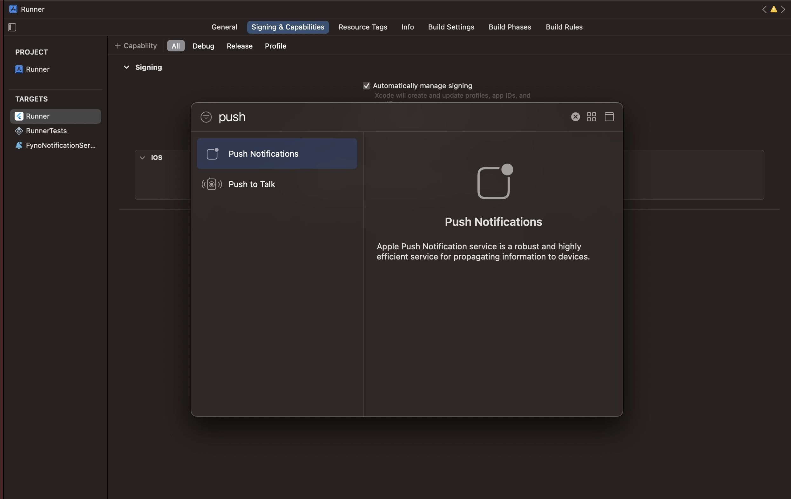
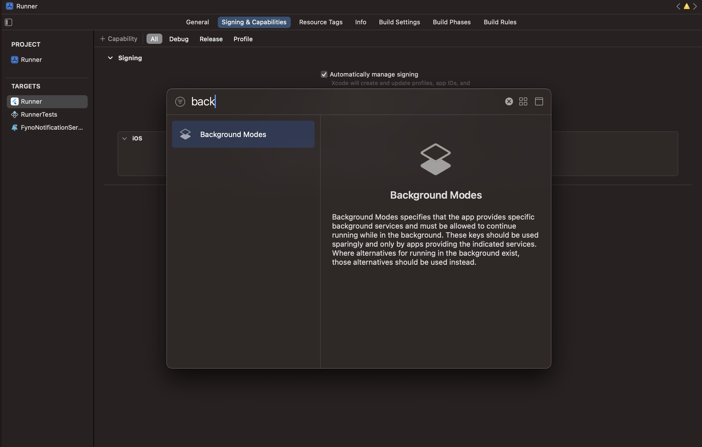
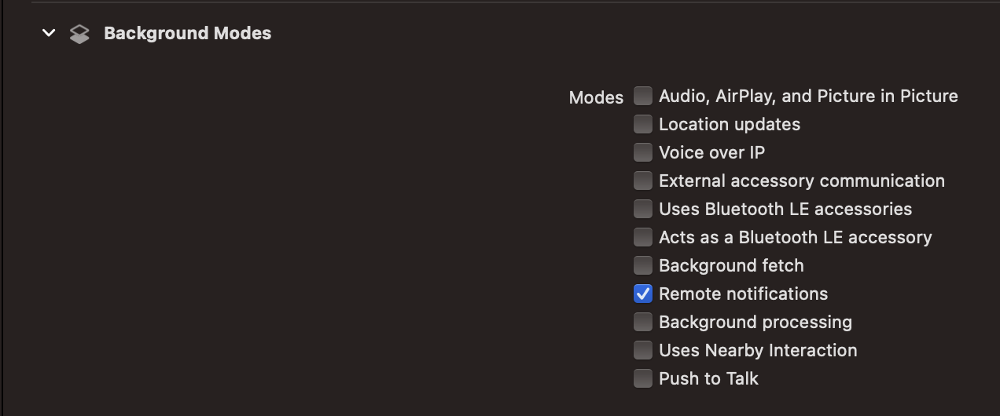
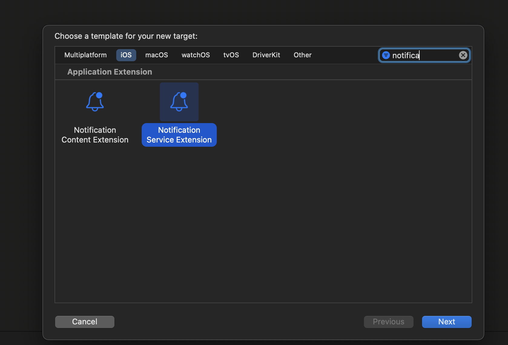
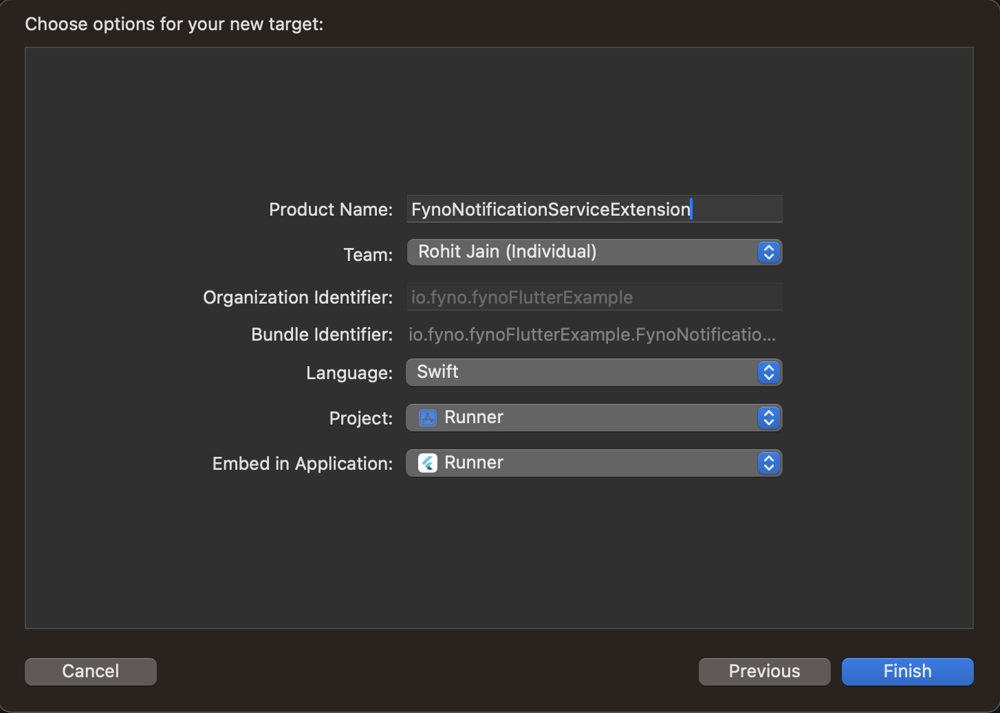
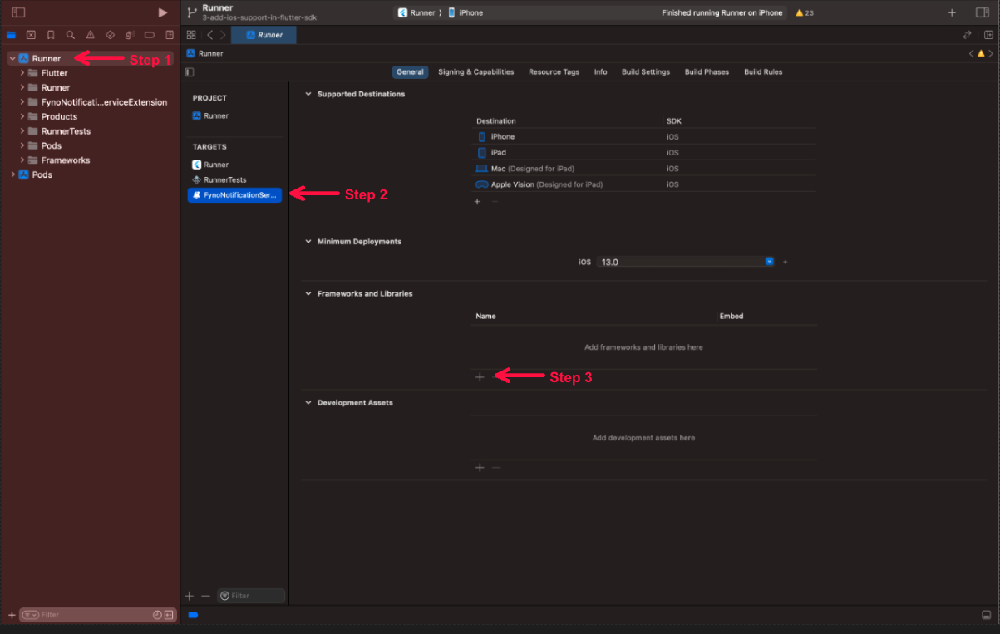
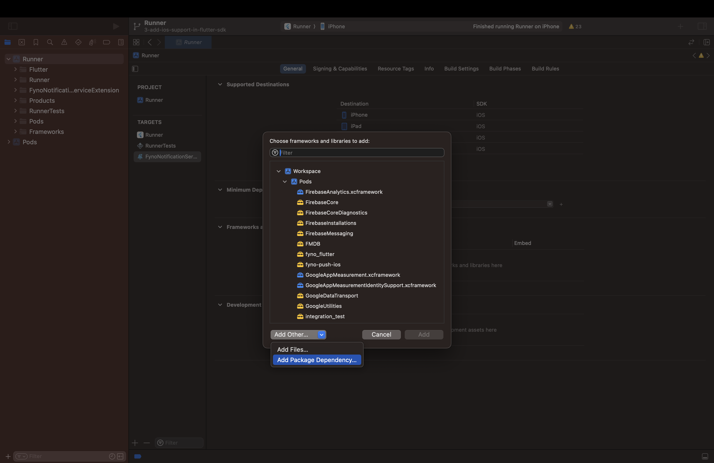
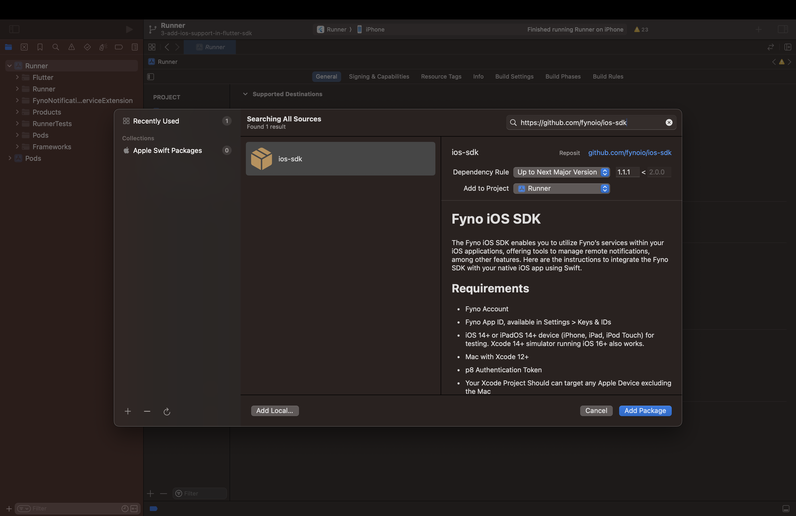
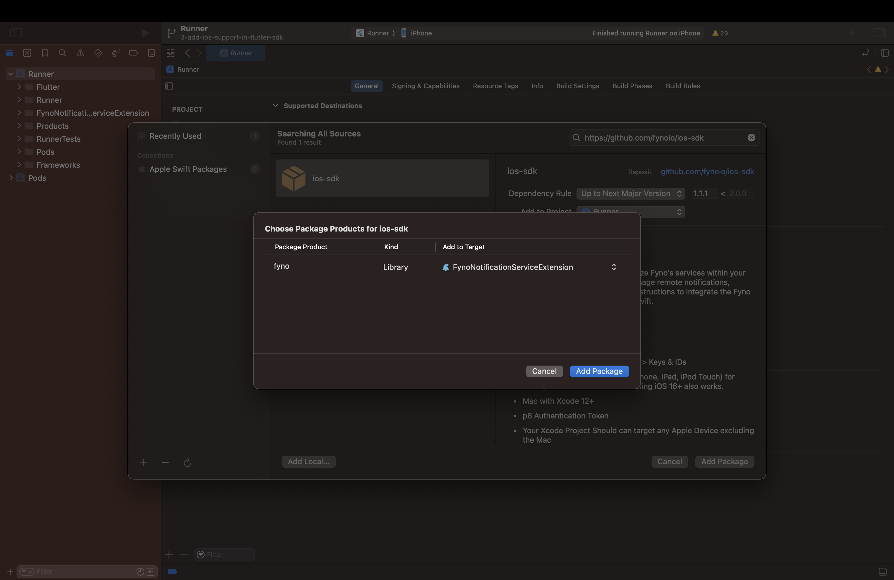

# Fyno iOS SDK

Fyno's iOS Push Notification SDK offers a comprehensive set of notification features within your app. It's designed to efficiently deliver messages, ensuring optimal performance and user experience.

## Prerequisites

In order to get started, there are a few prerequisites that needs to be in place:

1. **Fyno account:** A valid Fyno workspace with at least one active API Key. For more info, refer [Workspace Docs](https://docs.fyno.io/docs/workspace-settings).
2. **Configuration:** Configure your Fyno Push provider in [Fyno App](https://app.fyno.io/integrations).
3. **Swift iOS application:** A working Swift iOS application in which you want to integrate the SDK.
4. **Apple developer account:** Required details are mentioned in [APNs Docs](https://docs.fyno.io/docs/push-apns).

## SDK Setup to enable Push Notifications

### Step 1: Install the SDK
Add ```pod 'fyno-push-ios', '~> 1.1'``` similar to the following to your Podfile:

```
target 'MyApp' do
  pod 'fyno-push-ios', '~> 1.1'
end
```

Then run a ```pod install``` inside your terminal to download and install the fyno push sdk for iOS.

### Step 2: Add Required Capabilities
1. Inside Targets select signing and capabilities.
2. Click on +capabilities and add Push Notifications and Background Modes capabilities to your application.





3. In Background Modes, select Remote Notifications option. We use background notifications to receive delivery reports when your app is in quit and background state. Refer [doc](https://developer.apple.com/documentation/usernotifications/setting_up_a_remote_notification_server/pushing_background_updates_to_your_app) to know more about background notifications.



### Step 3: Add Notification Service Extension to your application

1. In Xcode go to **File** > **New** > **Target**.
2. Select `Notification Service Extension` from the template list.
3. Then in Next popup give it any product name, select your team, select swift language and click finish.





4. After clicking on "Finish", a folder will be created with your given product name. Replace the contents of the **NotificationService.swift** file with the below code.

```
import UserNotifications
import UIKit
import fyno

class NotificationService: UNNotificationServiceExtension {
    var contentHandler: ((UNNotificationContent) -> Void)?
    var bestAttemptContent: UNMutableNotificationContent?

    override func didReceive(_ request: UNNotificationRequest, withContentHandler contentHandler: @escaping (UNNotificationContent) -> Void) {
        fyno.app.handleDidReceive(request, withContentHandler: contentHandler)
    }

    override func serviceExtensionTimeWillExpire() {
        if let contentHandler = contentHandler, let bestAttemptContent =  bestAttemptContent {
            contentHandler(bestAttemptContent)
        }
    }
}
```

5. In order for the **Notification Service Extension** to be able to access the fyno SDK, you will have to import it by following the below steps:





Search for `https://github.com/fynoio/ios-sdk` in the text box. Select and add the package named **ios-sdk**.



Select the Target as the Notification Service Extension you had created and click on `Add Package`.



### Step 4: Register for push notification in AppDelegate.swift file

1. Add the below code in your **AppDelegate.swift** file.

> 🚧 Add the FCM integration code if you want to use FCM in iOS (we recommend to register with APNs)

```
// without FCM

import Foundation
import UIKit
import fyno_push_ios

class AppDelegate: UIResponder, UIApplicationDelegate, UNUserNotificationCenterDelegate  {
    let fynosdk  =  fyno.app

    func application(_ application: UIApplication, didFinishLaunchingWithOptions launchOptions: [UIApplication.LaunchOptionsKey: Any]?) -> Bool {
       UNUserNotificationCenter.current().delegate = fynosdk

        fynosdk.requestNotificationAuthorization { granted in
            if granted {
                DispatchQueue.main.async {
                    self.fynosdk.registerForRemoteNotifications()
                }
            }
        }
        
        return true
    }

    func application(_ application: UIApplication, didFailToRegisterForRemoteNotificationsWithError error: Error) {
        print("Failed to register for remote notifications: \(error.localizedDescription)")
    }
    
    func application(_ application: UIApplication, didRegisterForRemoteNotificationsWithDeviceToken deviceToken: Data) {
        // Send the device token to fynoServer
        fynosdk.setdeviceToken(deviceToken: deviceToken)
    }
}
```

```
// with FCM

import Foundation
import UIKit
import fyno_push_ios

// imports required for FCM integration
import FirebaseCore
import FirebaseMessaging

class AppDelegate: UIResponder, UIApplicationDelegate, UNUserNotificationCenterDelegate  {
    let fynosdk  =  fyno.app

    func application(_ application: UIApplication, didFinishLaunchingWithOptions launchOptions: [UIApplication.LaunchOptionsKey: Any]?) -> Bool {
       UNUserNotificationCenter.current().delegate = fynosdk

        fynosdk.requestNotificationAuthorization { granted in
            if granted {
                DispatchQueue.main.async {
                    self.fynosdk.registerForRemoteNotifications()
                }
            }
        }
        
        FirebaseApp.configure() // add only if FCM has been integrated
        
        return true
    }

    func application(_ application: UIApplication, didFailToRegisterForRemoteNotificationsWithError error: Error) {
        print("Failed to register for remote notifications: \(error.localizedDescription)")
    }
    
    func application(_ application: UIApplication, didRegisterForRemoteNotificationsWithDeviceToken deviceToken: Data) {
        // Send the device token to fynoServer
        fynosdk.setdeviceToken(deviceToken: deviceToken)

        Messaging.messaging().apnsToken = deviceToken // add only if FCM has been integrated
    }
}
```

> 👍 You have successfully configured the iOS SDK for receiving push notifications.

## Usage

### Initialising the SDK (should be called on app launch)

- Workspace ID(Mandatory) - Fyno's unique workspace ID, which you will see at the top of the **Workspace Settings** page.
- API Key(Mandatory) - An API (Application Programming Interface) key is a code used to identify and authenticate an application or user. Create an API Key by following [API Keys](https://docs.fyno.io/docs/api-keys).
- Distinct ID(Optional) - Unique identifier for your user (An [uuid](https://en.wikipedia.org/wiki/Universally_unique_identifier) is automatically generated if no value is passed).
- Version(Optional) - Indicates the environment in which the user has to be created. Could be either **test** or **live**. (Default value is "live").

```Text swift
fyno.app.initializeApp(
    workspaceID: workspaceId,
    apiKey: apiKey,
    distinctId: userId,
    version: version
){
    initResult in
    switch initResult {
    case .success(_):
        print("Initialization successful")
    case .failure(let error):
        print(error)
    }
}
```

### Identifying the User (should be called when you want to update previously created distinct ID or user name)

- Distinct ID(Mandatory) - The distinct ID you want to identify the user with.
- User Name(Optional) - The name you want to assign to the user.

```Text swift
fyno.app.identify(newDistinctId: distinctID, userName: userName) { identifyResult in
    switch identifyResult{
    case .success(_):
        print("Identify successful")
    case .failure(let error):
        print(error)
    }
}
```

### Registering Push Notifications with APNs or Google FCM

- Integration ID(Mandatory) - The ID of the integration created in [Fyno Integrations](https://app.fyno.io/integrations).
- isAPNs(Mandatory) - Use **true** if [APNs](https://docs.fyno.io/docs/push-apns) is configured, **false** if [Google FCM](https://docs.fyno.io/docs/push-fcm) is configured in the integration.

```Text swift
fyno.app.registerPush(integrationID: integrationId,isAPNs: isAPNs){
    registerPushResult in
    switch registerPushResult{
    case .success(_):
        print("registerPush successful")
    case .failure(let error):
        print(error)
    }
}
```

### Merging User Profiles

- Old Distinct ID(Mandatory).
- New Distinct ID(Mandatory).

```Text swift
fyno.app.mergeProfile(newDistinctId:newDistinctId){
    mergeResult in
    switch mergeResult{
    case .success(_):
        print("mergeProfile successful")
    case .failure(let error):
        print(error)
    }
}
```

### Updating Message Status

- Callback URL(Mandatory) - You can get the Callback URL from the notification additional payload if the notification was triggered from Fyno.
- Status(Mandatory) - The status of the notification (one of **RECEIVED**, **CLICKED** or **DISMISSED**).

```Text swift
fyno.app.updateStatus(callbackUrl: callbackUrl, status: status){
    updateStatusResult in
    switch updateStatusResult{
    case .success(_):
        print("updateStatus successful")
    case .failure(let error):
        print(error)
    }
}
```

### Resetting User Information

```Text swift
fyno.app.resetUser() {
    resetUserResult in
    switch resetUserResult{
    case .success(_):
        print("resetUser successful")
    case .failure(let error):
        print(error)
    }
}
```